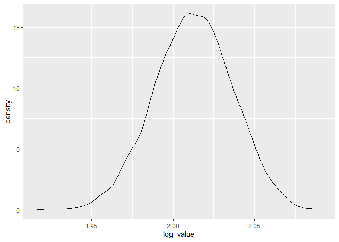

HW6
================
2022-11-21

# problem 1

    ## Registered S3 method overwritten by 'hoardr':
    ##   method           from
    ##   print.cache_info httr

    ## using cached file: C:\Users\Lenovo\AppData\Local/Cache/R/noaa_ghcnd/USW00094728.dly

    ## date created (size, mb): 2022-09-29 10:32:41 (8.418)

    ## file min/max dates: 1869-01-01 / 2022-09-30

## r²

``` r
result <- weather_df %>% 
  modelr::bootstrap(n=5000) %>%
  mutate(
    models = map(strap, ~lm(tmax ~ tmin, data = .x) ),
    r_results = map(models, broom::glance),
    beta_results = map(models, broom::tidy))
```

## plot of r²

``` r
result %>%
  select(r_results) %>% 
  unnest()%>%
  ggplot(aes(x=r.squared)) + geom_density()
```

    ## Warning: `cols` is now required when using unnest().
    ## Please use `cols = c(r_results)`

<!-- -->

``` r
result %>%
  select(r_results) %>% 
  unnest()%>%
  summarize(
    mean = mean(r.squared),
    se = sd(r.squared),
    "2.5-quantile" = mean(r.squared)+qnorm(0.025)*sd(r.squared),
    "97.5-quantile" = mean(r.squared)+qnorm(0.775)*sd(r.squared)
  )
```

    ## Warning: `cols` is now required when using unnest().
    ## Please use `cols = c(r_results)`

    ## # A tibble: 1 × 4
    ##    mean      se `2.5-quantile` `97.5-quantile`
    ##   <dbl>   <dbl>          <dbl>           <dbl>
    ## 1 0.911 0.00870          0.894           0.918

R square is likely to be symmetrically distributed with mean 0.91, the
2.5 quantile and 97.5 quantile is 0.894 and 0.918

``` r
beta_df <- result %>% 
  select(beta_results) %>% 
  unnest(beta_results) %>% 
  select(term, estimate) %>% 
  pivot_wider(
    names_from = term,
    values_from = estimate
  ) %>% 
  janitor::clean_names() %>% 
  unnest() %>% 
  mutate(log_value = log(intercept*tmin)) 
```

    ## Warning: Values from `estimate` are not uniquely identified; output will contain list-cols.
    ## * Use `values_fn = list` to suppress this warning.
    ## * Use `values_fn = {summary_fun}` to summarise duplicates.
    ## * Use the following dplyr code to identify duplicates.
    ##   {data} %>%
    ##     dplyr::group_by(term) %>%
    ##     dplyr::summarise(n = dplyr::n(), .groups = "drop") %>%
    ##     dplyr::filter(n > 1L)

    ## Warning: `cols` is now required when using unnest().
    ## Please use `cols = c(intercept, tmin)`

``` r
beta_df %>%
   ggplot(aes(x = log_value)) + geom_density()
```

<!-- -->

``` r
beta_df %>% 
  summarize(
    mean= mean(log_value),
    se = sd(log_value),
    "2.5-quantile" = mean(log_value)+qnorm(0.025)*sd(log_value),
    "97.5-quantile" = mean(log_value)+qnorm(0.775)*sd(log_value)
  )
```

    ## # A tibble: 1 × 4
    ##    mean     se `2.5-quantile` `97.5-quantile`
    ##   <dbl>  <dbl>          <dbl>           <dbl>
    ## 1  2.01 0.0240           1.97            2.03

log(β1\*β2) is likely to be symmetrically distributed with mean 2.01 .
The 2.5% quantile and 97.5% quantile are 1.966 and 2.031.

# Problem 2

## Import data and tidy data

``` r
url <- 'https://raw.githubusercontent.com/washingtonpost/data-homicides/master/homicide-data.csv'
homicides_df <- read_csv(url(url), na = c(" ", "Unknown"))
```

    ## Rows: 52179 Columns: 12
    ## ── Column specification ────────────────────────────────────────────────────────
    ## Delimiter: ","
    ## chr (8): uid, victim_last, victim_first, victim_race, victim_sex, city, stat...
    ## dbl (4): reported_date, victim_age, lat, lon
    ## 
    ## ℹ Use `spec()` to retrieve the full column specification for this data.
    ## ℹ Specify the column types or set `show_col_types = FALSE` to quiet this message.

``` r
homicides_df <- homicides_df %>% 
  mutate(city_state = str_c(city, state, sep = ", "),
         whether_solved = ifelse(
           disposition %in% c("Closed without arrest", "Open/No arrest"), 0, 1)) %>%
  filter(!city_state %in% c("Dallas, TX", "Phoenix, AZ","Kansas City, MO", "Tulsa, AL")) %>%
  filter(victim_race %in% c("White", "Black"))%>%
  filter(!victim_age == "Unknown") %>%
  mutate(victim_age = as.numeric(victim_age),
         victim_race = as.factor(victim_race),
         victim_sex = as.factor(victim_sex))
head(homicides_df)
```

    ## # A tibble: 6 × 14
    ##   uid    repor…¹ victi…² victi…³ victi…⁴ victi…⁵ victi…⁶ city  state   lat   lon
    ##   <chr>    <dbl> <chr>   <chr>   <fct>     <dbl> <fct>   <chr> <chr> <dbl> <dbl>
    ## 1 Alb-0…  2.01e7 SATTER… VIVIANA White        15 Female  Albu… NM     35.1 -107.
    ## 2 Alb-0…  2.01e7 MULA    VIVIAN  White        72 Female  Albu… NM     35.1 -107.
    ## 3 Alb-0…  2.01e7 BOOK    GERALD… White        91 Female  Albu… NM     35.2 -107.
    ## 4 Alb-0…  2.01e7 MARTIN… GUSTAVO White        56 Male    Albu… NM     35.1 -107.
    ## 5 Alb-0…  2.01e7 GRAY    STEFAN… White        43 Female  Albu… NM     35.1 -107.
    ## 6 Alb-0…  2.01e7 DAVID   LARRY   White        52 Male    Albu… NM     NA     NA 
    ## # … with 3 more variables: disposition <chr>, city_state <chr>,
    ## #   whether_solved <dbl>, and abbreviated variable names ¹​reported_date,
    ## #   ²​victim_last, ³​victim_first, ⁴​victim_race, ⁵​victim_age, ⁶​victim_sex

Fit a logistic regression with resolved vs unresolved as the outcome and
victim age, sex and race as predictors for Baltimore, MD.

``` r
logi_baltimore= 
  homicides_df %>% 
  filter(city_state=="Baltimore, MD") %>% 
  glm(whether_solved ~ victim_age+victim_race+victim_sex, data=., family= binomial())

logi_baltimore %>%
  broom::tidy() %>%
   mutate(
    estimate = exp(estimate),
    lower = exp(confint(logi_baltimore)[,1]),
    upper = exp(confint(logi_baltimore)[,2])
   ) %>%
    filter(term == "victim_sexMale") %>%
  select(estimate, lower, upper)
```

    ## Waiting for profiling to be done...
    ## Waiting for profiling to be done...

    ## # A tibble: 1 × 3
    ##   estimate lower upper
    ##      <dbl> <dbl> <dbl>
    ## 1    0.426 0.324 0.558

Thus, we come to conclude that, male has 0.426 times the odds of getting
a resolved case compare to female.

Now, Run for all other cities

``` r
# Create a function
city_odds <- function(df){
  
logi_cities <- glm(whether_solved ~ victim_age+victim_race+victim_sex,data = df , family= binomial())

logi_cities %>%
  broom::tidy() %>%
   mutate(
    estimate = exp(estimate),
    lower = exp(confint(logi_cities)[,1]),
    upper = exp(confint(logi_cities)[,2])
   ) %>%
    filter(term == "victim_sexMale") %>%
  select(estimate, lower, upper)
  
}

# apply function to cities
result_df = 
  homicides_df %>% 
  select(city_state, victim_age, victim_race, victim_sex, whether_solved)%>%
  nest(df = victim_age:whether_solved) %>%
   mutate(
    model = map(df, city_odds)
  ) %>%
  select(city_state, model)%>%
  unnest(model)
head(result_df)
```

    ## # A tibble: 6 × 4
    ##   city_state      estimate lower upper
    ##   <chr>              <dbl> <dbl> <dbl>
    ## 1 Albuquerque, NM    1.77  0.825 3.76 
    ## 2 Atlanta, GA        1.00  0.680 1.46 
    ## 3 Baltimore, MD      0.426 0.324 0.558
    ## 4 Baton Rouge, LA    0.381 0.204 0.684
    ## 5 Birmingham, AL     0.870 0.571 1.31 
    ## 6 Boston, MA         0.667 0.351 1.26

## Create plot

``` r
ggplot(result_df, aes(x=fct_reorder(city_state, estimate), y=estimate))+
  geom_point()+
  geom_errorbar(aes(ymin=lower, ymax=upper))+
  labs(title = "Odds ratio of resolved homicide cases of male against female ", 
       x = "city",
       y = "odds ratio") +
  theme(axis.text.x = element_text(angle = 75, hjust = 1))
```

<!-- -->

The estimate of odds ratio of most cities are less than one, which means
in these cities, male victims have a less chance of having a resolved
case than female. In some cities like New York, Baton Rouge, Omaha and
Chicago, etc. Even the upper limit of CI is less than one. Therefore in
these cities, sex is strong related to whether the case was resolved.
But in cities like Fresno, Stockton and Albuquerque, the CI is very
wider, which indicates that sex is less likely to be related to the
disposition of the case.

# Problem3

``` r
#import data
bw_df <- read.csv("data/birthweight.csv")
#tidy data
bw_df <- bw_df %>% 
  mutate(
         babysex = factor(babysex,levels = c(1, 2),labels = c("Male", "Female")),
         frace = factor(frace, levels = c(1, 2, 3, 4, 8, 9),labels = c("White", "Black", "Asian", "Puerto Rican", "Other", "Unknown")), 
         malform = factor(malform,levels = c(0, 1),labels = c("Absent", "Present")),
         mrace = factor(mrace,levels = c(1, 2, 3, 4, 8),labels = c("White", "Black", "Asian", "Puerto Rican", "Other"))
        )%>%
  filter(!frace == "Unknown")%>%
  na.omit()
head(bw_df)
```

    ##   babysex bhead blength  bwt delwt fincome frace gaweeks malform menarche
    ## 1  Female    34      51 3629   177      35 White    39.9  Absent       13
    ## 2    Male    34      48 3062   156      65 Black    25.9  Absent       14
    ## 3  Female    36      50 3345   148      85 White    39.9  Absent       12
    ## 4    Male    34      52 3062   157      55 White    40.0  Absent       14
    ## 5  Female    34      52 3374   156       5 White    41.6  Absent       13
    ## 6    Male    33      52 3374   129      55 White    40.7  Absent       12
    ##   mheight momage mrace parity pnumlbw pnumsga    ppbmi ppwt smoken wtgain
    ## 1      63     36 White      3       0       0 26.27184  148      0     29
    ## 2      65     25 Black      0       0       0 21.34485  128      0     28
    ## 3      64     29 White      0       0       0 23.56517  137      1     11
    ## 4      64     18 White      0       0       0 21.84508  127     10     30
    ## 5      66     20 White      0       0       0 21.02642  130      1     26
    ## 6      66     23 White      0       0       0 18.60030  115      0     14

I assume that all factors contribute to birthweight at first, than we
can use backward stepwise to select the best model

``` r
# Fit the full model 
full.model <- lm(bwt ~., data = bw_df)
# Stepwise regression model
step.model <- MASS::stepAIC(full.model, direction = "backward", 
                      trace = FALSE)
summary(step.model)
```

    ## 
    ## Call:
    ## lm(formula = bwt ~ babysex + bhead + blength + delwt + fincome + 
    ##     gaweeks + mheight + mrace + parity + ppwt + smoken, data = bw_df)
    ## 
    ## Residuals:
    ##      Min       1Q   Median       3Q      Max 
    ## -1097.18  -185.52    -3.39   174.14  2353.44 
    ## 
    ## Coefficients:
    ##                     Estimate Std. Error t value Pr(>|t|)    
    ## (Intercept)       -6098.8219   137.5463 -44.340  < 2e-16 ***
    ## babysexFemale        28.5580     8.4549   3.378 0.000737 ***
    ## bhead               130.7770     3.4466  37.944  < 2e-16 ***
    ## blength              74.9471     2.0190  37.120  < 2e-16 ***
    ## delwt                 4.1067     0.3921  10.475  < 2e-16 ***
    ## fincome               0.3180     0.1747   1.820 0.068844 .  
    ## gaweeks              11.5925     1.4621   7.929 2.79e-15 ***
    ## mheight               6.5940     1.7849   3.694 0.000223 ***
    ## mraceBlack         -138.7925     9.9071 -14.009  < 2e-16 ***
    ## mraceAsian          -74.8868    42.3146  -1.770 0.076837 .  
    ## mracePuerto Rican  -100.6781    19.3247  -5.210 1.98e-07 ***
    ## parity               96.3047    40.3362   2.388 0.017004 *  
    ## ppwt                 -2.6756     0.4274  -6.261 4.20e-10 ***
    ## smoken               -4.8434     0.5856  -8.271  < 2e-16 ***
    ## ---
    ## Signif. codes:  0 '***' 0.001 '**' 0.01 '*' 0.05 '.' 0.1 ' ' 1
    ## 
    ## Residual standard error: 272.3 on 4328 degrees of freedom
    ## Multiple R-squared:  0.7181, Adjusted R-squared:  0.7173 
    ## F-statistic: 848.1 on 13 and 4328 DF,  p-value: < 2.2e-16

We use the stepwise model and plot residuals against fitted values

``` r
bw_df %>% 
  add_residuals(step.model) %>% 
  add_predictions(step.model) %>% 
  ggplot(aes( x = pred, y = resid)) +
  geom_point(alpha = 0.3)+
  xlab("fitted values") +
  ylab("residual")
```

<!-- -->

From the plot, we see that residuals centered around 0 and most of the
predicted weight is around 3200. But when fitted values are small, the
residuals are high.

## Compare the models

``` r
# cross validation
cv_df <- 
  crossv_mc(bw_df, 100) %>%  
  mutate(
    train = map(train, as_tibble),
    test = map(test, as_tibble)
  )

cv_df <- 
  cv_df %>% 
  mutate(
    model1 = map( train, ~lm(bwt ~ blength + gaweeks, data = bw_df)),
    model2 =  map( train, ~lm(bwt ~ bhead + blength + babysex + bhead*blength + blength*babysex + bhead*babysex + bhead*blength*babysex, data = bw_df)),
    mymodel = map( train, ~lm( bwt ~ babysex + bhead + blength + delwt + fincome + gaweeks + mheight + mrace + parity + ppwt + smoken, data = bw_df))) %>%
   mutate(
    rmse_model1 = map2_dbl( model1,  test, ~rmse(model = .x, data =.y)),
    rmse_model2 = map2_dbl( model2,  test, ~rmse(model = .x, data =.y)),
    rmse_mymodel = map2_dbl( mymodel, test, ~rmse(model = .x, data =.y))
  ) 
cv_df
```

    ## # A tibble: 100 × 9
    ##    train    test     .id   model1 model2 mymodel rmse_model1 rmse_model2 rmse_…¹
    ##    <list>   <list>   <chr> <list> <list> <list>        <dbl>       <dbl>   <dbl>
    ##  1 <tibble> <tibble> 001   <lm>   <lm>   <lm>           340.        288.    273.
    ##  2 <tibble> <tibble> 002   <lm>   <lm>   <lm>           332.        300.    285.
    ##  3 <tibble> <tibble> 003   <lm>   <lm>   <lm>           330.        291.    273.
    ##  4 <tibble> <tibble> 004   <lm>   <lm>   <lm>           322.        278.    263.
    ##  5 <tibble> <tibble> 005   <lm>   <lm>   <lm>           357.        298.    290.
    ##  6 <tibble> <tibble> 006   <lm>   <lm>   <lm>           337.        293.    277.
    ##  7 <tibble> <tibble> 007   <lm>   <lm>   <lm>           357.        290.    272.
    ##  8 <tibble> <tibble> 008   <lm>   <lm>   <lm>           369.        316.    297.
    ##  9 <tibble> <tibble> 009   <lm>   <lm>   <lm>           350.        294.    278.
    ## 10 <tibble> <tibble> 010   <lm>   <lm>   <lm>           328.        284.    270.
    ## # … with 90 more rows, and abbreviated variable name ¹​rmse_mymodel

Let’s make a plot to show the distribution of RMSE

``` r
cv_df %>%
  select(starts_with("rmse")) %>% 
  pivot_longer(
    everything(),
    names_to = "model", 
    values_to = "rmse",
    names_prefix = "rmse_") %>% 
  mutate(model = fct_inorder(model)) %>% 
  ggplot(aes(x = model, y = rmse)) + geom_violin()
```

<!-- -->

From the plot, we see that our stepwise model has the lowest RMSE. The
adjusted R-squared is 0.7173, which indicates the model fits well.
Therefore I choose to select stepwise model as the best model.
